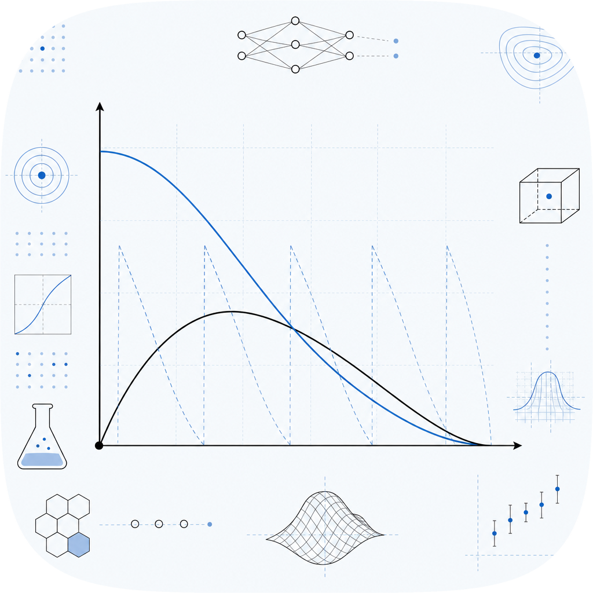

# lrsched

<p align="center">
  
</p>

[](https://pypi.org/project/lrsched/)
[](https://github.com/amaar-mc/lrsched/actions/workflows/ci.yml)
[](./LICENSE)

Framework-agnostic learning-rate schedules as pure functions, in Python with zero dependencies. Each schedule maps a step to a learning rate, so it works in any training loop or framework, or none.

## Install

```sh
pip install lrsched
```

## 30-second example

```python
from lrsched import cosine, with_warmup, sample

schedule = with_warmup(
    cosine(base_lr=1e-3, min_lr=1e-5, total_steps=1000),
    warmup_steps=100,
    start_lr=0.0,
)

lr = schedule(250)            # learning rate at step 250
curve = sample(schedule, num_steps=1000)  # the whole curve, for plotting or logging
```

A schedule is just `Callable[[int], float]`. Plug `schedule(step)` into your optimizer
however your framework expects, or use it to drive a plain training loop.

## Why this exists

Every learning-rate scheduler is tied to a framework: `torch.optim.lr_scheduler`,
`timm`, `transformers`, or `optax` for JAX. If you write a custom loop, use a
non-PyTorch stack, or just want to plot a schedule, you end up pasting a `LambdaLR`
snippet. `lrsched` is a small, dependency-free library where each schedule is a pure
function, easy to test, plot, log, and reuse anywhere.

## Comparison

| | lrsched | torch / timm | optax |
|---|:---:|:---:|:---:|
| Framework | none | PyTorch | JAX |
| Pure step to lr function | yes | no (optimizer-bound) | partial |
| Zero dependencies | yes | no | no |
| Composable warmup and phases | yes | partial | yes |

## Schedules

- `constant`, `step_decay`, `multi_step`, `exponential`
- `linear`, `polynomial`, `polynomial_decay`
- `exponential_decay`: `base_lr * decay_rate ** (t / decay_steps)` with `0 < decay_rate < 1`
- `cosine`, `cosine_restarts` (SGDR)
- `inverse_sqrt` (Transformer)
- `one_cycle`
- `triangular`, `triangular2`, `exp_range` (cyclical learning rates)

`polynomial_decay(start_lr, end_lr, total_steps, power)`: `(start_lr - end_lr) * (1 - t/T)**p + end_lr`, holds `end_lr` past `total_steps`.
`exponential_decay(base_lr, decay_rate, decay_steps)`: `base_lr * decay_rate ** (t / decay_steps)`.
`step_decay(base_lr, drop, step_size)`: `base_lr * drop ** floor(t / step_size)`, with `0 < drop <= 1`.

## Composition

- `with_warmup(schedule, ...)` prepends a linear warmup.
- `sequential(phases)` runs schedules back to back.
- `sample(schedule, num_steps=...)` evaluates a schedule over a range.

Parameters are required keyword arguments, so every schedule reads explicitly at the call
site. Schedules hold their final value past the end rather than erroring, and a negative
step raises.

## Per-parameter-group learning rates

`scale_by_group` applies fixed per-group multipliers to any base schedule, returning a
function from step to `dict[str, float]`. Useful for discriminative learning rates where
different layers or modules train at different rates:

```python
from lrsched import cosine, scale_by_group

base = cosine(base_lr=1e-3, min_lr=1e-5, total_steps=1000)
group_lr = scale_by_group(base, multipliers={"backbone": 0.1, "head": 1.0})

lrs = group_lr(250)  # {"backbone": ..., "head": ...}
# plug into your optimizer's param_groups, keyed by name
```

Each multiplier must be a positive finite number. An empty mapping and non-positive or
non-finite multipliers all raise `ValueError` with a descriptive message.

## Command line

Sample a schedule from the terminal, one value per step or as a sparkline:

```sh
lrsched cosine --base-lr 1e-3 --min-lr 1e-5 --total-steps 1000 --steps 1000
lrsched triangular --min-lr 1e-4 --max-lr 1e-2 --step-size 200 --steps 800 --sparkline
```

Supports cosine, linear, exponential, step, triangular, and one-cycle.

## Examples

```sh
python examples/schedules.py
```

## Testing

```sh
pip install -e ".[dev]"
pytest
```

Tests cover the exact value of each schedule at known steps, schedule-specific shapes
(restarts, the one-cycle peak, the warmup handoff), and invariants checked with
Hypothesis (cosine stays within bounds, warmup is monotone).

## Contributing

Issues and pull requests are welcome. See [CONTRIBUTING.md](./CONTRIBUTING.md).

## License

MIT. See [LICENSE](./LICENSE).
